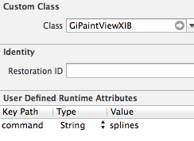
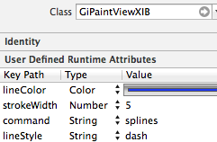
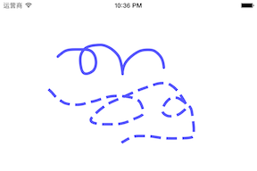

## 例1：使用StoryBoard绘图
-----------

> 本例介绍在StoryBoard中使用TouchVG的方法，可以不写绘图代码。

1. 使用 Single View Wizard 等向导创建工程

2. 在 Podfile 文件中导入TouchVG：

        platform :ios, '6.0'
        pod 'TouchVG'

   然后运行`pod install`下载TouchVG代码。后续可运行 `pod update --no-repo-update` 加快下载速度，不用每次检查最新版本。

   然后打开 *.xcworkspace 进入 Xcode。

3. 将 `ViewController.m`改为`ViewController.mm`。TouchVG是用C++实现的，在程序工程中至少有一个文件是.mm后缀名，否则会出现链接错误。

4. 打开 Main.storyboard ，拖动一个新 View 到主视图上，设置此新视图的Class为`GiPaintViewXIB`，添加值为`splines`的串属性`command`，如下左图所示。该属性可自动启动随手画曲线命令，运行后的手绘效果如下右图所示。

    

   可以设置更多属性，得到如下的手绘效果。利用属性可以在界面设计阶段指定绘图效果，而不用写相应的绘图代码。可用的绘图属性见 [GiPaintViewXIB.h](https://github.com/rhcad/vgios/blob/develop/include/GiPaintViewXIB.h)。`command`属性用于设置绘图命令，命令名见 [可用的命令列表](http://touchvg.github.io/pages/Commands.html)。

     

## 例2：增加Undo/Redo功能
-----------

1. 在工程中添加Undo、Redo的按钮图片，每个按钮都有可用和不可用两种状态图片，共4个图片。

2. 在StoryBoard中添加两个按钮，设置图片属性和自动布局约束。

3. 按住 Ctrl 拖动按钮到 ViewController.mm 中，创建属性变量和动作方法。

        @interface ViewController ()
        @property (weak, nonatomic) IBOutlet UIButton *undoButton;
        @property (weak, nonatomic) IBOutlet UIButton *redoButton;
        @end

        @implementation ViewController

        - (void)viewDidLoad {
            [super viewDidLoad];
        }

        - (IBAction)undo:(id)sender {
        }

        - (IBAction)redo:(id)sender {
        }

        @end

4. 在 ViewController.mm 中导入 `GiViewHelper.h`，在 viewDidLoad 中启用Undo功能，实现Undo/Redo按钮方法：

        - (void)viewDidLoad {
            [super viewDidLoad];
            
            NSString *path = [LIBRARY_FOLDER stringByAppendingString:@"undo"];
            [[GiViewHelper sharedInstance]startUndoRecord:path];
        }

        - (IBAction)undo:(id)sender {
            [[GiViewHelper sharedInstance]undo];
        }

        - (IBAction)redo:(id)sender {
            [[GiViewHelper sharedInstance]undo];
        }

   运行程序，画几个图，试试Undo/Redo按钮吧。虽然能工作了，但按钮可用状态未显示出来。

5. 在 ViewController 中实现 `GiPaintViewDelegate` 观察者协议的 `onContentChanged:` 方法，注册此观察者。

        @interface ViewController ()<GiPaintViewDelegate>
        ...
        - (void)viewDidLoad {
            [super viewDidLoad];
            ...
            GiViewHelper *hlp = [GiViewHelper sharedInstance];

            [hlp startUndoRecord:[LIBRARY_FOLDER stringByAppendingString:@"undo"]];
            [hlp addDelegate:self];
            [self onContentChanged:hlp.view];
        }

        - (void)onContentChanged:(id)view {
            GiViewHelper *hlp = [GiViewHelper sharedInstance];
            self.undoButton.enabled = [hlp canUndo];
            self.redoButton.enabled = [hlp canRedo];
        }